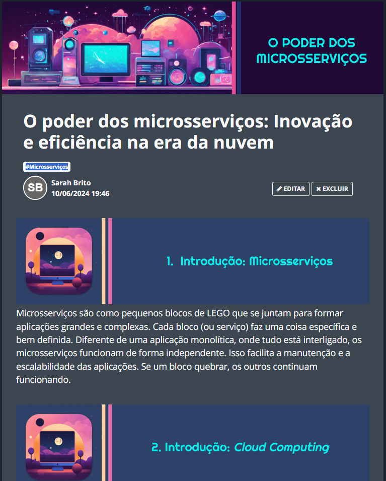

# Projeto artigo técnico gerado por I.A.s

 > ℹ️ **NOTE:** Este é o repositório desenvolvido durante o curso na plataforma da [DIO](https://dio.me).

Projeto com o objetivo de gerar um artigo técnico com um layout rico, leitura agradável e com foco em promover sua autoridade técnica.

<a href="https://web.dio.me/articles/o-poder-dos-microsservicos-inovacao-e-eficiencia-na-era-da-nuvem?back=%2Farticles&open-modal=true&page=1&order=oldest" title="View now"> 📕Clique aqui para ler o artigo</a>

## 💻 Tecnologias utilizadas no projeto

- [ChatGPT](https://chat.openai.com/) - Para título e conteúdo;
- [Lexica.art](https://lexica.art/) - Para gerar imagens;
- [Google Apresentações](https://docs.google.com/presentation) - Para formatação da capa e blocos.

## 📄 Prompts e ferramentas

ChatGPT：

|   Ação   | prompt                                                                                                                                                                                                                                                                         |
| :------: | ------------------------------------------------------------------------------------------------------------------------------------------------------------------------------------------------------------------------------------------------------------------------------ |
|  Título  | Criar 10 opções de títulos chamativos para um artigo sobre porque os microsserviços são o futuro no desenvolvimento cloud |
| Conteúdo | Comporte-se como um escritor de artigo de tecnologia backend e escreva um artigo de acordo com as regras abaixo: REGRAS -> - Separe em blocos por assunto; - No máximo 5 linhas por bloco; - Ao final, criar um call to action para as redes sociais; - Escreve de forma informal, como se explicasse para alguém novo na área de tecnlogia; - Os blocos devem ser criados para os seguintes assuntos: 1. Introdução sobre microsserviços; 2. Introdução sobre cloud computing; 3. A importância de trabalhar com microsserviços em cloud computing; 4. O futuro dos sistemas e como está ligado à cloud computing; 5. Conclusão. |

Lexica.art：

- No léxica foi utilizado o acervo público de imagens geradas por outras pessoas, os termos de pesquisa foram:

• Cloud computing cartoon art;
• Computer futurist icon;

## ✨ Features

- Conteúdo gerado via ChatGPT
- Imagens do acervo público geradas via Lexica.art

## 📚 Materiais

- prompts utilizados

## 🛠️ Instruções de execução

Utilize os prompts acima nas ferramentas sugeridas para gerar o material base e utilize uma ferramenta de edição de documentos como PowerPoint, Libreoffice, Google Apresentações ou Indesign para diagramação.
